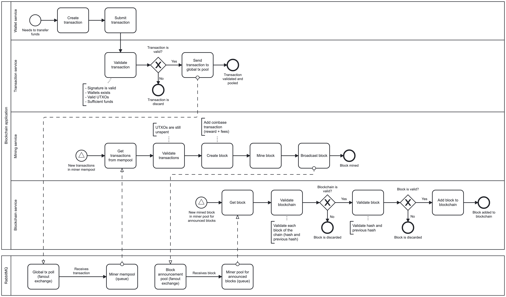

# NestJS Blockchain and Cryptocurrency transactions

A NestJS project that demonstrates (generally) how blockchain works in the context of cryptocurrency transactions.

# Contents
- [Disclaimer](#disclaimer)
- [Conceptualization](#conceptualization)
  - [Main characteristics of this conceptualization](#main-characteristics-of-this-conceptualization)
  - [Process flow](#process-flow)
  - [Concepts](#concepts)
    - [Wallet](#wallet)
      - [Transaction](#transaction)
      - [Transaction validation](#transaction-validation)
      - [Inputs and outputs](#inputs-and-outputs)
    - [Mining](#mining)
      - [Proof of work](#proof-of-work)
    - [Block](#block)
    - [Blockchain](#blockchain)
    - [RabbitMQ for the transaction pools](#rabbitmq-for-the-transaction-pools)

# Disclaimer

This project is not intended to be a full implementation of a blockchain network. It is a simple demonstration of how blockchain works in the context of cryptocurrency transactions. Moreover, most of the concepts are simplified and not compliant with the real-world blockchain networks.

# Conceptualization

As explained earlier, this project will be implemented as a conceptualization of the real-world blockchain networks. In this section, there will be a brief explanation of how this conceptualization was implemented.

## Main characteristics of this conceptualization

The following are the characteristics of this conceptualization that differs this project from a real-world blockchain network:

- There is no peer-to-peer network.
- There are no multiple miners competing to mine the block.
- There is only one ledger (blockchain).
- All the actors and services are running in the same process.

## Process flow

For a better understanding of the process flow and the different intervenients, please refer to the following diagram.

## Concepts

In the next sub sections, there will be a description of the concepts implemented in this project.

### Wallet

#### Transaction

#### Transaction validation

#### Inputs and outputs

### Mining

#### Proof of work

### Block

### Blockchain

### RabbitMQ for the transaction pools
